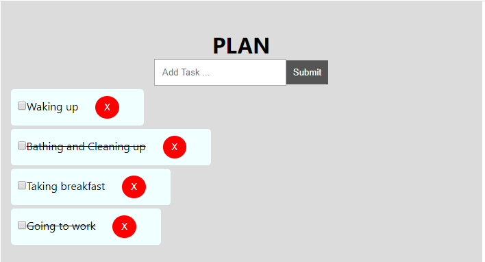

## Todo App

In the project I am creating a REACT TODO APP, where its loads 4 default tasks, which you can delete and add more

### `npm start`

Runs the app in the development mode. 
Open [http://localhost:3000](http://localhost:3000) to view it in the browser.

### `SKILLS PRACTICED`
 - ES6 syntax
 - React props
 - Higher order functions
 - Arrow functions

### `SnapShot`

